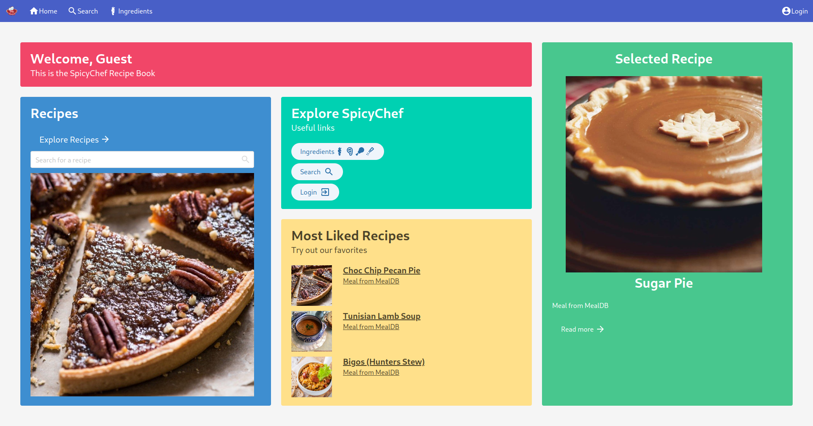
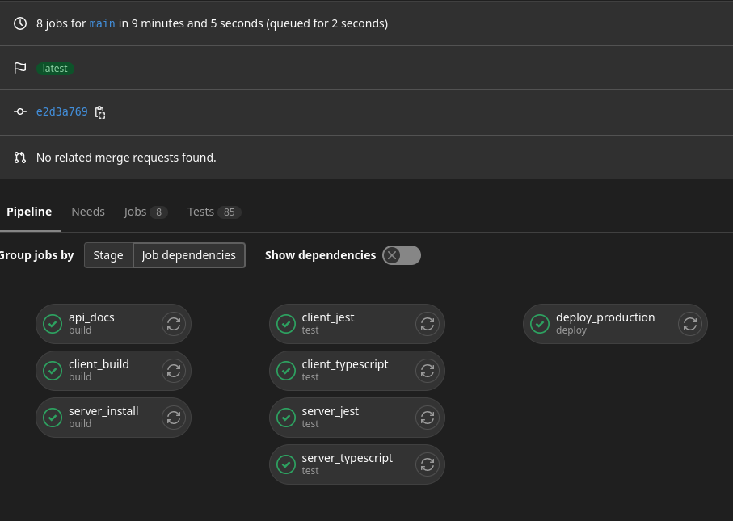

# dcst2002-recipe-gr2

## Detailed instructions, descriptions and details can be found in
- [client/README.md](client/README.md)
- [server/README.md](server/README.md)

## See the live production server
- https://recipe.feal.no

## Quick start
To get started with the development version, you can use the Makefile.

System requirements: `make`(only for quick start), `node` version 16.18.0 and `npm`.

* Install dependencies and build the client files with `make build`
  * For professors running the provided zip file, the environment files are already provided with everything configured.

  * Otherwise, when running the public distribution:
    * Make sure to follow the .env-instructions in client/README and server/README
    * After `make install`, enter the `/server` directory and run `npm run initdb` to create the required database tables

* Start the server with `make run`
* View the page in your browser by visiting `http://localhost:3001`, unless you changed your environment files.

------------------

# Introduction

SpicyChef is an online recipe application. It is developed by students at NTNU, for an obligatory assignement in DCST2002 Webutvikling.

# Usage / Features

- Recipes can be browsed and searched in [/recipes](https://recipe.feal.no/recpies) and [/search](https://recipe.feal.no/search)
- Users can sign in using google
- Users can like recipes, and find them in [/likes](https://recipe.feal.no/likes)
- Ingredients can be added to the users shopping list in [/list](https://recipe.feal.no/list)
- Recipes can be filtered and found by their tags, categories, area of origin and their number of likes
- Administrators can easily edit and add new recipes, or automatically import them from TheMealDB

# Development

- The client and the server are independent projects, separated in [/client](/client) and [/server](/server)
- The two parts communicate via a REST API, described in [/api-docs](https://recipe.feal.no/api-docs)
- Changes are verified and tested, before they are automatically deployed by our CI/CD pipelines

