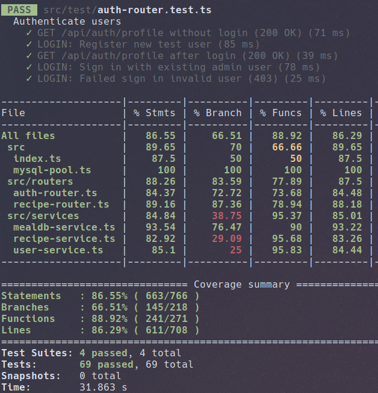

# SpicyChef Backend

### [API documentation is found here](https://recipe.feal.no/api-docs)
# Description

The SpicyChef backend is written entirely in node, using TypeScript, Express.js, Passport.js and other common node libraries.

The backend exposes an API, intended to be used with the SpicyChef client.
This backend server is configured by default to serve the API on `yourdomain/api/`, and serve the bundled client application on all other paths(eg. `yourdomain/*`).

## Development setup

1. Download or clone the project
2. Build the client
   * The client should be bundled as described in [client/README.md](../client/README.md)
   * Put the public build directory somewhere accessible, and note the location in the env file
3. Register a Google API application
   * Follow Step 1 of [this guide](https://docs.dittofi.com/third-party-apis/oauth-2.0-apis/google-oauth-2.0-part-i)
   * Note your client id and api secret
4. Install npm dependencies
   * `npm install`, alternatively `npm ci` for known exact versions.
5. Populate the environment file as described below
   * Use a randomly generated session secret with high entroyp
   * Remember to insert your Google API details and callback URL
6. Initialize the database
   * `npm run initdb`
7. Start the development server
   * `npm start`
8. Open the application in your browser
   * The app should be running on `http://localhost:3000` when using the supplied dotenv

### env file example
The following, modified for your needs, should be placed in `.env` in this directory.
```shell
PORT=3000
CLIENT_BUILD_PATH='/../../client/public'
MYSQL_HOST=mysql.example.com
MYSQL_USER=spicychef
MYSQL_PASSWORD=spicychefpassword
MYSQL_DATABASE=spicychef
GOOGLE_OAUTH_ID=YOURGOOGLEID
GOOGLE_OAUTH_SECRET=YOURGOOGLESECRET
GOOGLE_CALLBACK_URL=http://yourdomain.com/api/auth/google/callback
SESSION_SECRET=supersecretcookiepassword
SESSION_SECURE_COOKIE=true
DEBUG=false
```

### Utilities

- Initialize and clear the database with `npm run initdb`
  - This will give an interactive prompt, verifying your database connection and creating the required tables.
  - Requires that a database and user are already be created in your database server, and that the details are entered in `.env`
- Import recipes from TheMealDB, see `npm run mealdb help`
  - Try `npm run mealdb getMeal 52814`
  - Try `npm run mealdb random`

### Documentation

- We use jsdoc through better-docs to generate API docs.
- Rebuild the documentation with `npm run docs`
- Read the docs [on our site](https://recipe.feal.no/api-docs)

### Tests

- We strive to test all aspects of our application.
- Tests must be configured in `.env.test`
  - This configuration is similar to `.env`, but we recommend using a separate testing database
  - All data will be erased
- Run the tests with `npm test`
- Show more verbose logs with `npm run test:debug`

Sample:



## Running the application in production

1. Follow [Development Setup](#development-setup) steps 1-6
2. Make a service, unit or supervisor configuration
   - An init system or supervisor will help starting, stopping, managing and logging the application.
   - Eg. write a basic systemd unit [like this](https://nodesource.com/blog/running-your-node-js-app-with-systemd-part-1/)
3. Configure a reverse proxy
   - The application is on its own strictly HTTP
   - Follow the guide and use letsencrypt or another TLS CA to sign HTTPS certificates
   - Run the application with PORT=3000 or something similar, and only expose ports 80 and 443 through the proxy
   - Eg. configure nginx [like this](https://www.sitepoint.com/configuring-nginx-ssl-node-js/)
   - Expose the service to the internet by forwarding ports to your host
4. Verify connectivity by visiting your new web service
